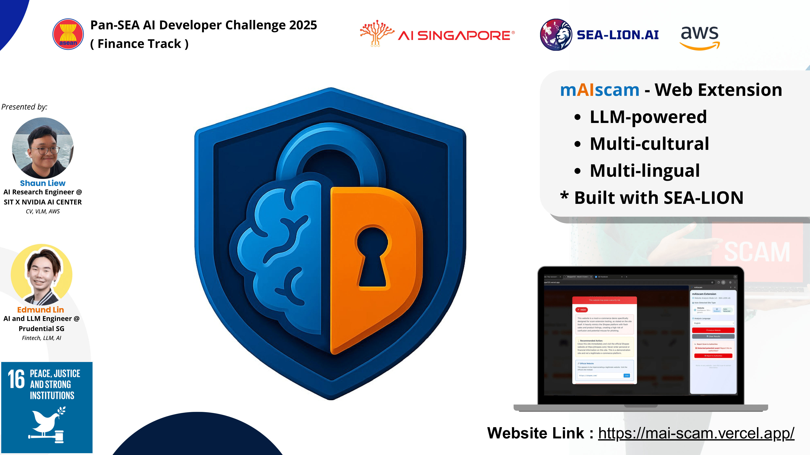
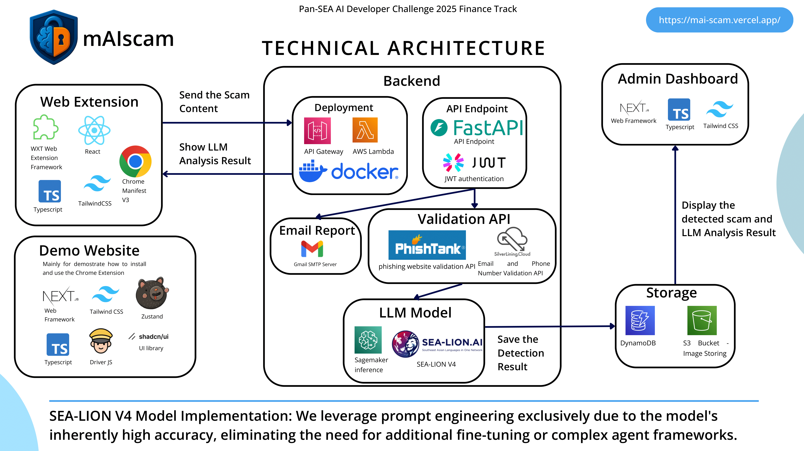

# mAIscam - LLM-Powered Multicultural Web Extension for Real-Time Scam Protection in SEA region

🛡️ **Intelligent Browser Extension for Real-Time Scam Detection**

Protecting Southeast Asian users from sophisticated scams with SEA-LIONv4 LLM technology across 13 local languages. Experience culturally-aware AI that understands regional scam patterns and linguistic nuances.

## 🏆 Pan-SEA AI Developer Challenge 2025 Submission

### **🚀 Quick Start for Judges**

**🎬 Watch Videos**: [Project Pitch](https://www.youtube.com/watch?v=GdSI_W8otxg) | [Demo Walkthrough](https://www.youtube.com/embed/rNhK1GPuOu0)

**📦 Try the Extension**: [Download & Install](https://mai-scam.vercel.app/installation) | **🌐 Live Demo Website**: [mai-scam.vercel.app](https://mai-scam.vercel.app/) | **📊 Analytics**: [Admin Dashboard](https://mai-scam-admin.vercel.app/)

---

## 🎯 Innovation & Impact

**Problem**: Southeast Asia faces a surge in sophisticated scams targeting diverse languages and cultural contexts, with limited AI solutions addressing regional nuances.

**Solution**: mAIscam leverages SEA-LIONv4 LLM to provide real-time, culturally-aware scam detection across email, web, and social media platforms in 13 Southeast Asian languages.

## 🧠 Technical Architecture

### **Core Technologies**

- **AI Engine**: SEA-LION v4 LLM for multilingual scam detection
- **Browser Extension**: WXT Web Extension Framework and TypeScript-based real-time protection
- **Backend**: FastAPI with AWS Lambda deployment
- **Frontend for Demo Website**: Next.js 15 with Tailwind CSS
- **Admin Dashboard Website**: Real-time monitoring admin dashboard for detected scams

### **Repository Structure**

| Repository | Purpose | Technology |
|------------|---------|------------|
| [mai-scam-extension](https://github.com/mAI-scam/mai-scam-extension) | Browser extension source code | TypeScript, Chrome APIs |
| [mai-scam-backend](https://github.com/mAI-scam/mai-scam-backend) | SEA-LION powered detection API | FastAPI, AWS Lambda |
| [mai-scam-frontend](https://github.com/mAI-scam/mai-scam-frontend) | Demo website for extension showcase | Next.js 15, TypeScript |
| [mai-scam-admin](https://github.com/mAI-scam/mai-scam-admin) | Analytics dashboard | TypeScript, Real-time monitoring |
| [shoppe123](https://github.com/mAI-scam/shoppe123) | Mock scam website for safe testing | TypeScript, Simulated phishing site |

## 🌏 Southeast Asia Focus

**Multilingual Support**: Indonesian, Malay, Thai, Vietnamese, Filipino, Chinese, Tamil, Hindi, Khmer, Lao, Myanmar, Javanese, Sundanese

**Cultural Awareness**: Trained on region-specific scam patterns, cultural contexts, and local language nuances using SEA-LION's specialized knowledge base.

## ⚡ Real-Time Protection Features

- **📧 Email Security**: Gmail integration with intelligent threat analysis
- **🌐 Website Protection**: URL validation and phishing detection
- **📱 Social Media Guard**: Twitter & Facebook post analysis with image recognition
- **🚨 Instant Alerts**: Real-time threat notifications and risk assessments

## 📋 Installation Guide for Judges

### **Method 1: Direct Installation**

1. Visit [mai-scam.vercel.app/installation](https://mai-scam.vercel.app/installation)
2. Download `maiscam-1.0.0-chrome.zip` from [GitHub Releases](https://github.com/mAI-scam/mai-scam-extension/releases)
3. Extract files and load as unpacked extension in Chrome
4. **Test safely** at [shoppe123.vercel.app](https://shoppe123.vercel.app/) (simulated phishing site)

### **Method 2: Demo Experience**

Visit [mai-scam.vercel.app](https://mai-scam.vercel.app/) for interactive demonstration without installation.

**⏱️ Performance**: First detection takes 15-30 seconds (AWS Lambda cold start), subsequent detections: 2-5 seconds.

## 🎬 Demo Materials

- **Project Pitch Video**: [YouTube Demo](https://www.youtube.com/watch?v=GdSI_W8otxg)
- **Technical Walkthrough**: [YouTube Tutorial](https://www.youtube.com/embed/rNhK1GPuOu0)
- **Live Analytics**: [Admin Dashboard](https://mai-scam-admin.vercel.app/)

---

**🔗 Quick Links**: [Extension](https://github.com/mAI-scam/mai-scam-extension) | [Installation](https://mai-scam.vercel.app/installation) | [Demo](https://mai-scam.vercel.app/) | [Dashboard](https://mai-scam-admin.vercel.app/)
